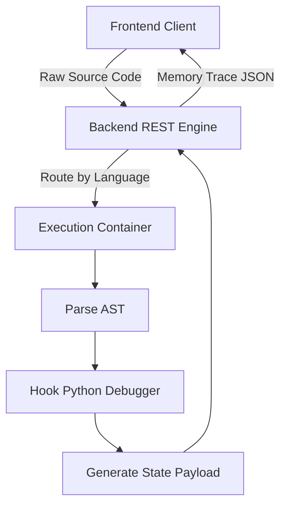

# Code Execution Engine: Pathrise Python Tutor Integration

[]()
[]()
[]()

## Overview
This repository contains a specialized fork and integration architecture of the open-source "Online Python Tutor" execution engine. It was adapted for internal tooling/educational usage, providing a backend infrastructure capable of ingesting raw Python, C, C++, and Java code, compiling it in real-time, and returning granular memory-state telemetry to a frontend client for visual step-by-step debugging.

## Problem Statement
Teaching algorithmic logic or debugging complex recursive functions is incredibly difficult without visual state tracing. Standard IDE debuggers are often too heavy for beginners, and `print()` statements fail to illustrate the Call Stack and Heap memory allocations dynamically. This repository solves that problem by integrating a robust backend service that intercepts the CPython interpreter, mapping execution state line-by-line and generating JSON payloads for visual frontend rendering.

## Key Features
- **Abstract Syntax Tree (AST) Interception:** Utilizes custom Python `bdb` (Debugger) hooks to freeze execution state and extract local/global variables at every compiler step.
- **Multi-Language Support:** Contains execution architectures for multiple language binaries via isolated backend containers (`v3`, `v4-cokapi`, `v5-unity`).
- **Memory Visualization:** Generates JSON representations of active pointers, memory references, and object instantiations.
- **Heroku Deployment Ready:** Configured with a standardized `Procfile` and `requirements.txt` for immediate deployment to PaaS infrastructure.

## Architecture



## Technology Stack
- **Backend:** Python (Flask/Bottle dependencies)
- **Frontend Interfacing:** JavaScript, D3.js (via inherited source)
- **Deployment:** Heroku (`Procfile`)
- **Documentation:** GitHub Flavored Markdown (GFM)

## Project Structure
```text
pathrise-python-tutor/
├── v3/                      # Legacy Python 2/3 execution hooks
├── v4-cokapi/               # C/C++ execution binaries
├── v5-unity/                # Unified multi-language backend routing
├── tests/                   # Pytest syntax validation wrappers
├── Procfile                 # Heroku deployment configuration
└── README.md                # System documentation
```

## Installation
Due to the complexity of the execution environment (which requires C/C++ compilers and specific Python binaries), deployment via Docker or Heroku is strongly recommended over local execution.
```bash
git clone https://github.com/krsna016/pathrise-python-tutor.git
cd pathrise-python-tutor
pip install -r requirements.txt
```

## Usage
Refer to the individual `v5-unity` server execution scripts to bind the backend engine to `localhost`.

## Examples
*Conceptual architecture of how the backend intercepts Python execution:*
```python
import bdb

class TraceDebugger(bdb.Bdb):
    def user_line(self, frame):
        # Freeze execution
        # Extract variables from 'frame.f_locals'
        # Append memory state to JSON payload
        pass
```

## Screenshots
> [!NOTE]
> *This repository primarily houses backend execution infrastructure. Visualizations occur on the client side.*

## Visual Demonstrations
> [!NOTE]
> *Backend JSON generation telemetry is standardized across the `v5-unity` architecture.*

## Testing
We utilize a dynamic Pytest wrapper to explicitly validate the modern `v5-unity` Python 3 scripts, ignoring legacy `v1-v2` directories which contain intentional Python 2 syntax architectures that would otherwise crash modern CI pipelines.
```bash
pytest tests/
```

## Performance Notes
- **Sandboxing:** Executing arbitrary user code is incredibly dangerous. This backend must be deployed within strict containerized sandboxes (e.g., Docker with dropped privileges or specific `chroot` jails) to prevent Host OS compromises via malicious `os.system()` inputs.

## Future Improvements
- **Dockerization:** Fully containerize the `v5-unity` architecture into a standalone `Dockerfile` to completely deprecate Heroku `Procfile` dependencies and improve local testing velocity.
- **WebSockets:** Upgrade the REST API execution model to utilize WebSockets, allowing real-time execution telemetry streaming for long-running scripts instead of waiting for the script to terminate.

## Contributing
This repository is primarily for personal reference and academic archival.

## License
Licensed under the MIT License.
